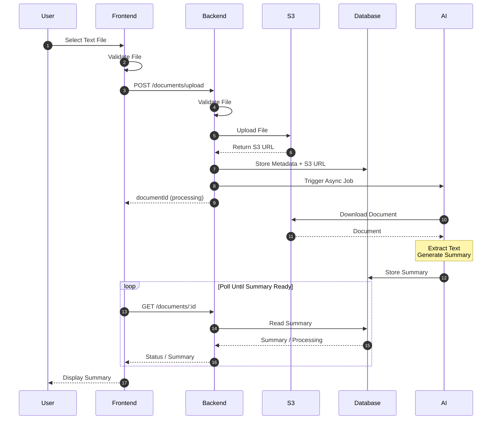
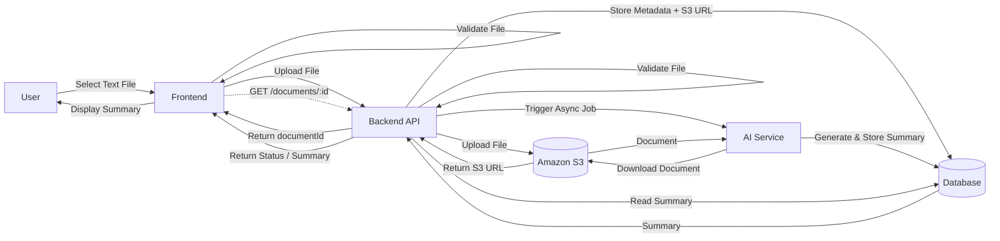

# AI Document Summarization Flow

## Overview

This system allows users to upload text documents for AI-powered summarization. The upload workflow is asynchronous. The frontend performs initial file validation before uploading the document. The backend validates the file again, uploads it to Amazon S3, stores the document metadata in the database, and triggers the AI service. The AI service processes the document in the background, generates a summary, and stores it in the database. The frontend periodically requests the summary until it becomes available.

---

# Flow

1. User selects a text document.
2. Frontend validates the selected file.
3. Frontend uploads the file to the Backend API.
4. Backend validates the uploaded file.
5. Backend uploads the file to Amazon S3.
6. Amazon S3 returns the file URL.
7. Backend stores the document metadata and S3 URL in the database.
8. Backend triggers the AI Service asynchronously.
9. Backend immediately returns the `documentId` with a `processing` status.
10. AI Service downloads the document from Amazon S3.
11. AI Service extracts the document content.
12. AI Service generates the summary.
13. AI Service stores the generated summary in the database.
14. Frontend periodically requests the document status using the `documentId`.
15. Backend retrieves the summary from the database.
16. Backend returns the summary to the frontend once available.
17. Frontend displays the generated summary.

---

# Sequence Diagram



---

# Architecture Diagram



---

# Data Flow

```text
User
   │
   ▼
Frontend
   │
   ├── Validate File
   │
   └── Upload File
          │
          ▼
Backend
   │
   ├── Validate File
   │
   ├────────────► Amazon S3
   │                 │
   │                 ▼
   │            File Stored
   │
   ├────────────► Database
   │      (Metadata + S3 URL)
   │
   ├────────────► AI Service (Async)
   │
   └────────────► Return documentId
                     │
                     ▼
                Frontend

──────────────────────────────────────

AI Service
     │
     ▼
Download Document from S3
     │
     ▼
Extract Content
     │
     ▼
Generate Summary
     │
     ▼
Store Summary in Database

──────────────────────────────────────

Frontend
     │
     ▼
Poll Backend
     │
     ▼
Backend
     │
     ▼
Read Summary from Database
     │
     ▼
Return Summary
     │
     ▼
Frontend
     │
     ▼
User
```

---

# Overall Pipeline

```text
User
 │
 ▼
Frontend
 │
 ├── Validate File
 │
 ├── Upload File
 ▼
Backend
 │
 ├── Validate File
 │
 ├── Upload File ─────────► Amazon S3
 │                            │
 │                            ▼
 │                       Return S3 URL
 │
 ├── Store Metadata ─────► Database
 │
 ├── Trigger AI Job ─────► AI Service
 │
 └── Return documentId ──► Frontend

──────────────────────────────────────

AI Service
 │
 ├── Download File from Amazon S3
 ├── Extract Content
 ├── Generate Summary
 └── Store Summary ──────► Database

──────────────────────────────────────

Frontend
 │
 ├── Poll Summary
 ▼
Backend
 │
 ├── Read Summary ───────► Database
 │                          │
 │                          ▼
 │                     Summary
 ▼
Return Summary
 │
 ▼
Frontend
 │
 ▼
Display Summary
```
