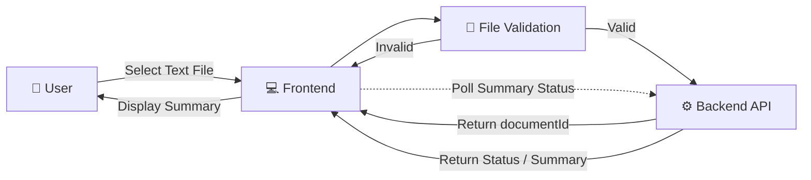
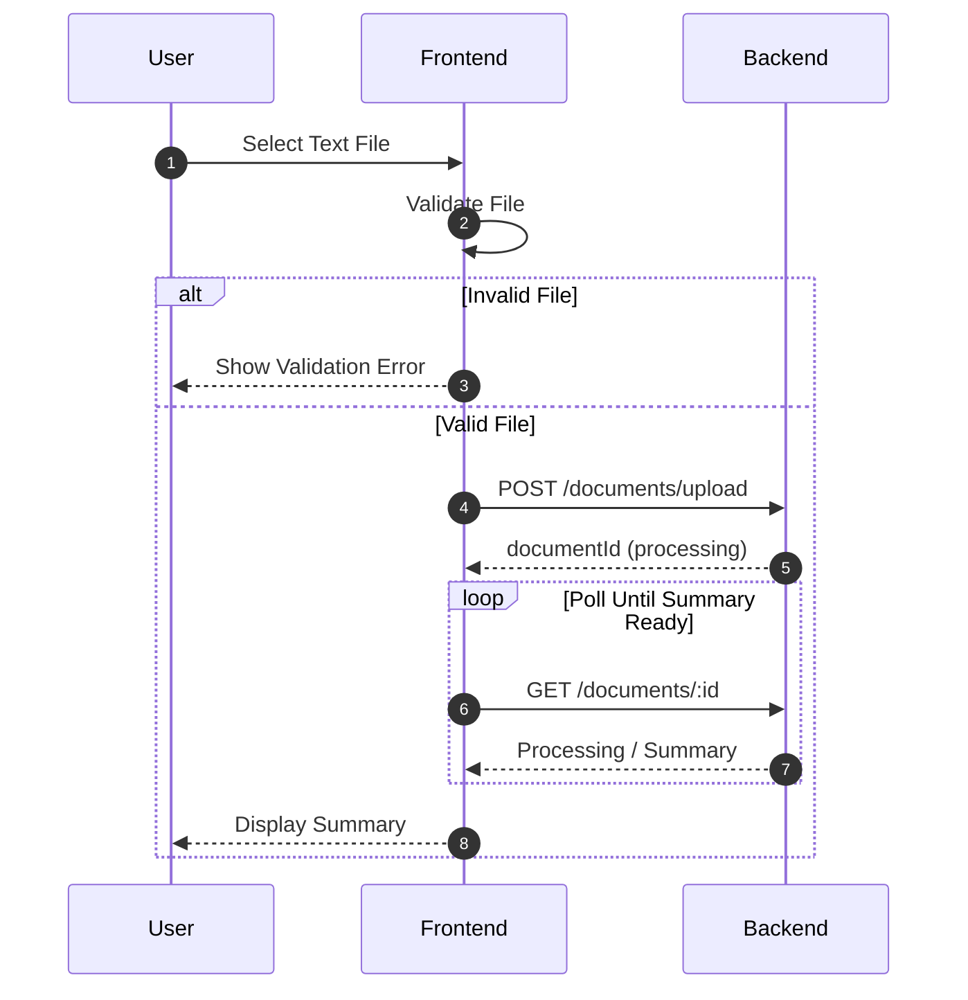

# Frontend Architecture

## Overview

The frontend is responsible for:

- Selecting a text document
- Validating the selected file
- Uploading the file to the Backend API
- Receiving the `documentId`
- Showing the processing state
- Polling the backend for the summary
- Displaying the generated summary

---

# Architecture Diagram



---

# Sequence Diagram



---

# Frontend Flow

```text
User
 │
 ▼
Select Text File
 │
 ▼
Validate File
 │
 ├── Invalid
 │      │
 │      └── Show Validation Error
 │
 └── Valid
        │
        ▼
Upload File
        │
        ▼
Receive documentId
        │
        ▼
Show Processing State
        │
        ▼
Poll Backend
        │
        ▼
Summary Ready
        │
        ▼
Display Summary
```

---
