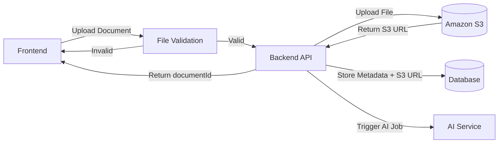
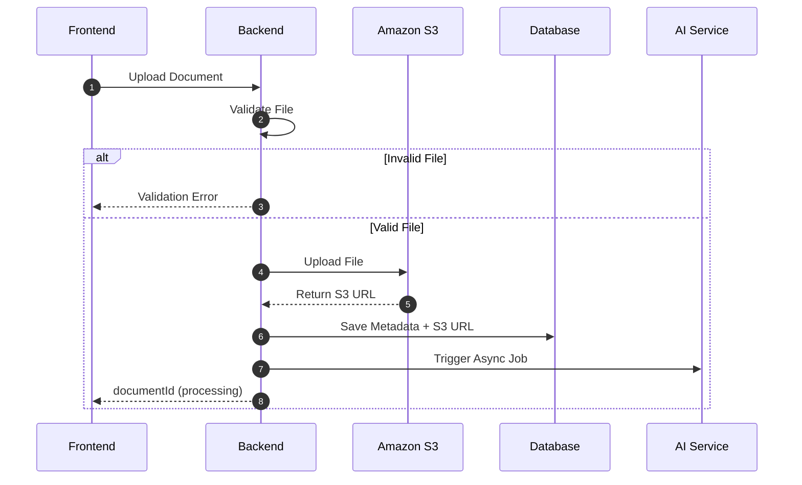

# Backend Architecture

## Overview

The backend is responsible for:

- Receiving uploaded documents from the frontend
- Validating uploaded files
- Uploading documents to Amazon S3
- Storing document metadata and the S3 URL in the database
- Triggering the AI Service asynchronously
- Returning the `documentId` to the frontend

---

# Architecture Diagram



---

# Sequence Diagram



---

# Backend Flow

```text
Frontend
    │
    ▼
Upload Request
    │
    ▼
Validate File
    │
    ├── Invalid
    │      │
    │      └── Return Validation Error
    │
    └── Valid
           │
           ▼
      Upload to Amazon S3
           │
           ▼
      Receive S3 URL
           │
           ▼
Store Metadata + S3 URL
           │
           ▼
Trigger AI Service
           │
           ▼
Return documentId
           │
           ▼
Frontend
```
