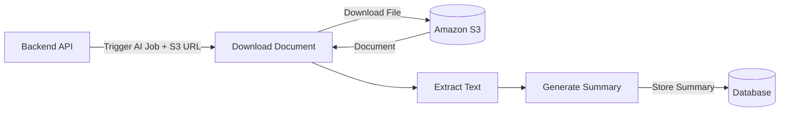
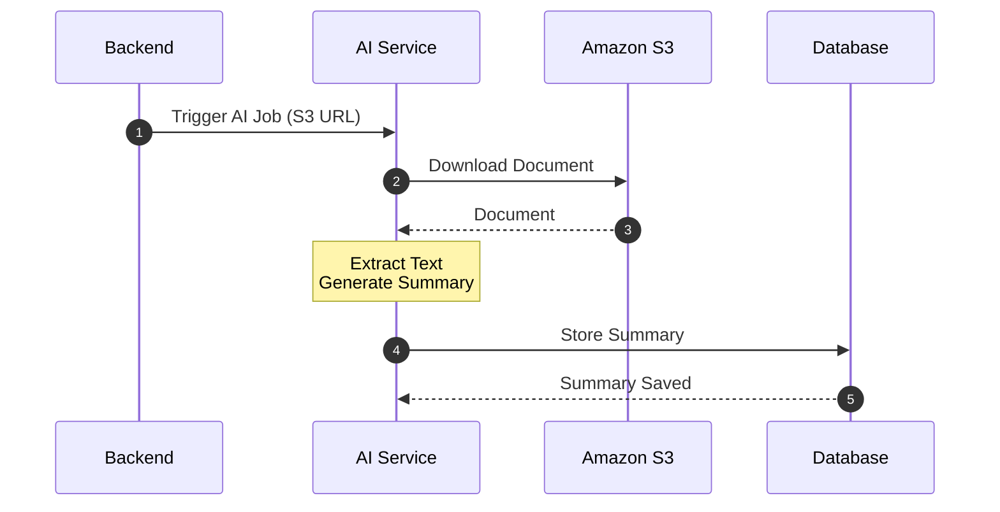

# AI Service Architecture

## Overview

The AI Service is responsible for:

- Receiving the S3 URL from the Backend
- Downloading the document from Amazon S3
- Extracting the document content
- Generating an AI summary
- Storing the generated summary in the database

---

# Architecture Diagram



---

# Sequence Diagram



---

# AI Flow

```text
Receive S3 URL
      │
      ▼
Download Document
      │
      ▼
Extract Text
      │
      ▼
Generate Summary
      │
      ▼
Store Summary in Database
```
