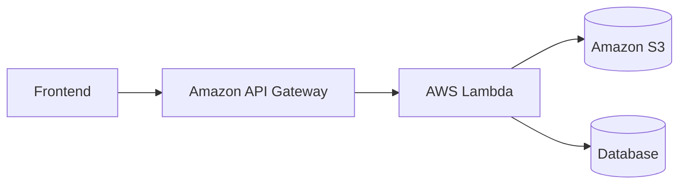

# Backend Deployment

## Overview

The backend is responsible for handling API requests, uploading documents to Amazon S3, storing metadata, triggering AI processing, and returning document status.

---

# AWS Services

| Service | Purpose |
|----------|---------|
| Amazon API Gateway | Expose REST APIs |
| AWS Lambda | Execute backend business logic |
| Amazon S3 | Store uploaded documents |
| Amazon RDS / DynamoDB | Store document metadata and AI summaries |
| IAM | Secure AWS resource access |
| CloudWatch | Logging and monitoring |

---

# Deployment Architecture



---

# Deployment Flow

```text
Frontend

↓

Amazon API Gateway

↓

AWS Lambda

↓

Amazon S3
(Database stores metadata & summaries)
```