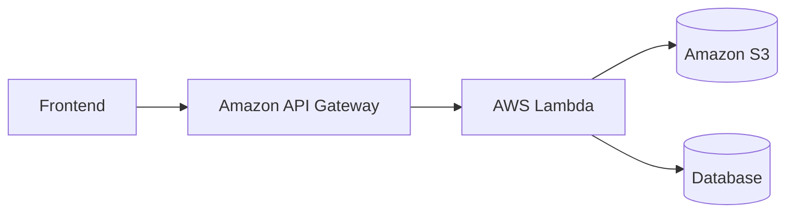
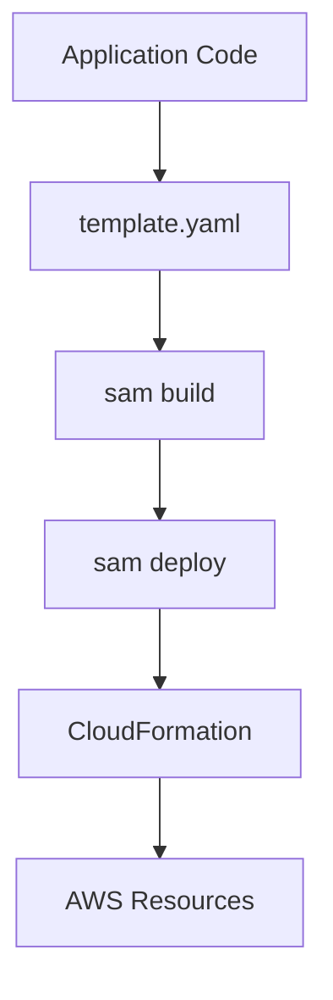
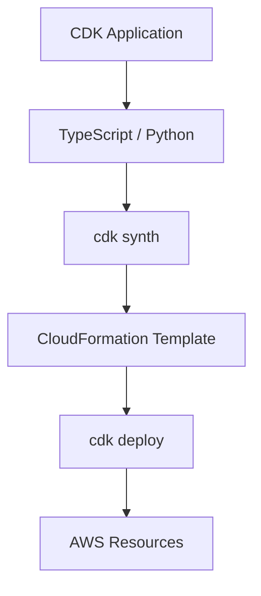
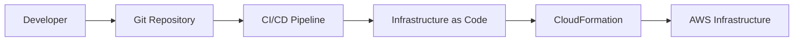
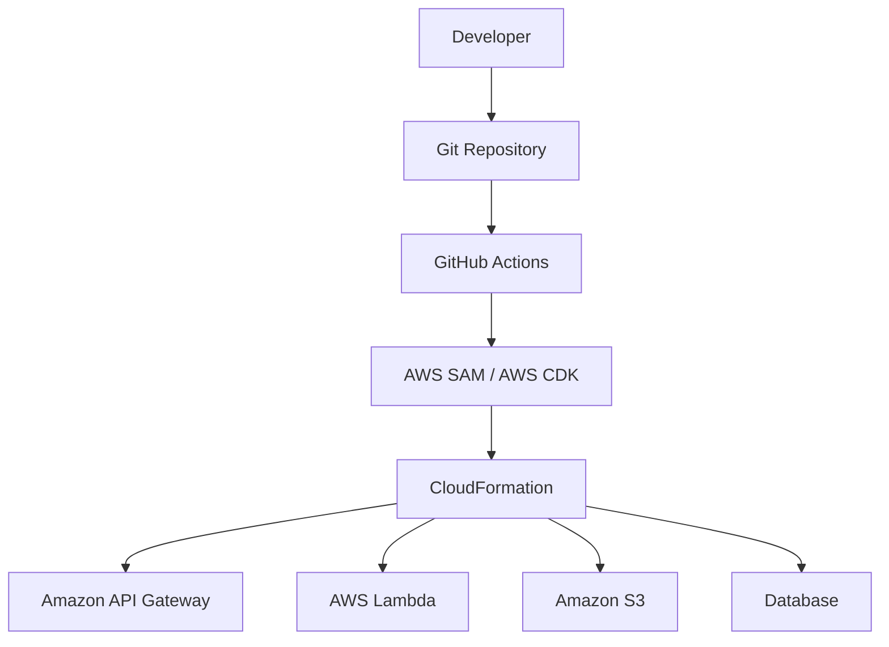

# Backend Deployment

## Overview

The backend is responsible for handling API requests, uploading documents to Amazon S3, storing metadata, triggering AI processing, and returning document status.

---

# AWS Services

| Service | Purpose |
|----------|---------|
| Amazon API Gateway | Expose REST APIs |
| AWS Lambda | Execute backend business logic |
| Amazon S3 | Store uploaded documents |
| Amazon RDS / DynamoDB | Store document metadata and AI summaries |
| IAM | Secure AWS resource access |
| Amazon CloudWatch | Logging and monitoring |

---

# Deployment Architecture



---

# Deployment Flow

```text
Frontend
    │
    ▼
Amazon API Gateway
    │
    ▼
AWS Lambda
    │
    ├────────► Amazon S3
    │
    └────────► Database
                  │
                  ▼
      Metadata & AI Summaries
```

---

# Deployment Options

The backend infrastructure can be deployed using multiple AWS Infrastructure as Code (IaC) approaches.

| Method | Description | Best For |
|----------|-------------|----------|
| AWS SAM | Simplifies deployment of Lambda-based serverless applications | Small to medium serverless projects |
| AWS CDK | Define AWS infrastructure using TypeScript, Python, Java, or C# | Medium to large applications |
| Infrastructure as Code (IaC) | Automate infrastructure deployment using code | All production environments |

---

# Option 1 — Deploy Using AWS SAM

AWS Serverless Application Model (SAM) is an extension of AWS CloudFormation specifically designed for serverless applications.

## Architecture



## Resources Created

- Amazon API Gateway
- AWS Lambda
- Amazon S3
- IAM Roles
- CloudWatch Logs

### Advantages

- Simple deployment process
- Local testing support
- Automatic Lambda packaging
- Built on CloudFormation
- Easy integration with CI/CD

---

# Option 2 — Deploy Using AWS CDK

AWS Cloud Development Kit (CDK) allows AWS infrastructure to be defined using familiar programming languages.

## Architecture



## Resources Created

- Amazon API Gateway
- AWS Lambda
- Amazon S3
- Amazon RDS / DynamoDB
- IAM Roles
- CloudWatch

### Advantages

- Infrastructure written as code
- Reusable components
- Easier maintenance
- Better for large applications
- Supports all AWS services

---

# Option 3 — Infrastructure as Code (IaC)

Infrastructure as Code enables automated, repeatable deployments through version-controlled templates.

## IaC Workflow



---

## Infrastructure Managed

- Amazon API Gateway
- AWS Lambda
- Amazon S3
- Amazon RDS / DynamoDB
- IAM Roles & Policies
- CloudWatch Logs
- Environment Variables
- Networking Configuration (Optional)

---

## Benefits of IaC

- Version-controlled infrastructure
- Automated deployments
- Repeatable environments
- Faster provisioning
- Easier rollback
- Reduced manual configuration
- Improved consistency across Development, Staging, and Production

---

# Recommended Deployment Strategy



---

# CI/CD Deployment Flow

```text
Developer
    │
    ▼
Push Code to GitHub
    │
    ▼
GitHub Actions
    │
    ▼
Build Application
    │
    ▼
Deploy Infrastructure
(AWS SAM / AWS CDK)
    │
    ▼
CloudFormation
    │
    ▼
AWS Resources Updated
```

---

# Deployment Summary

| Component | Service |
|------------|---------|
| API | Amazon API Gateway |
| Compute | AWS Lambda |
| Storage | Amazon S3 |
| Database | Amazon RDS / DynamoDB |
| Security | IAM |
| Monitoring | Amazon CloudWatch |
| Infrastructure | AWS SAM / AWS CDK |
| Provisioning | CloudFormation |
| CI/CD | GitHub Actions |

---

