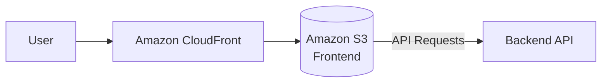

# Frontend Deployment

## Overview

The frontend is a static React application deployed on AWS.

---

# AWS Services

| Service | Purpose |
|----------|---------|
| Amazon S3 | Host static frontend files (HTML, CSS, JavaScript, Images) |
| Amazon CloudFront | Content Delivery Network (CDN) for fast global access |
| Amazon Route 53 *(Optional)* | Domain and DNS management |
| AWS Certificate Manager (ACM) *(Optional)* | SSL/TLS certificate for HTTPS |

---

# Deployment Architecture



---

# Deployment Flow

```text
React Build

↓

Amazon S3

↓

Amazon CloudFront

↓

Users
```